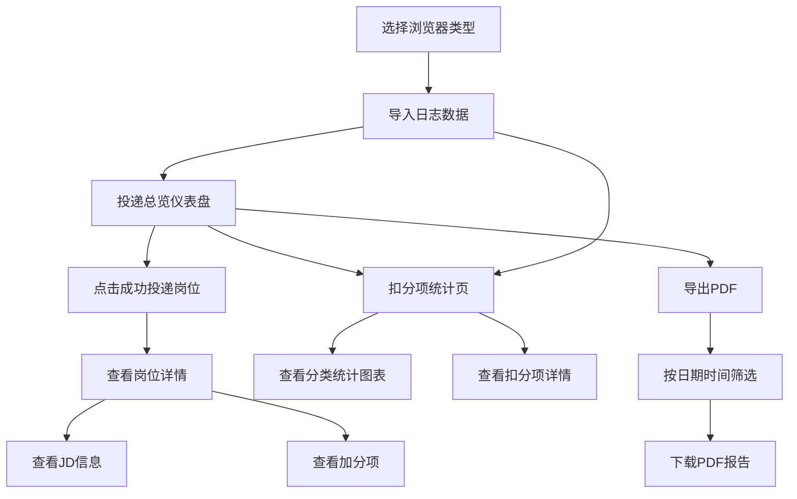

## 1. 产品概述

Boss直聘自动投递日志分析工具 — 一款桌面客户端 Web 应用，用于读取火狐/Chrome 浏览器中 Boss 直聘自动投递的日志数据，可视化展示投递成功岗位、JD 详情、加分项分析以及扣分项统计，并支持按日期时间筛选导出 PDF 报告。

- **核心问题**：求职者在使用 Boss 直聘自动投递后，需要直观了解投递结果、分析被筛选的原因，优化简历和投递策略
- **目标用户**：使用 Boss 直聘自动投递工具的求职者
- **产品价值**：将分散的浏览器日志数据转化为可视化分析报告，帮助用户洞察投递效率与简历匹配度

## 2. 核心功能

### 2.1 用户角色

| 角色 | 描述 |
|------|------|
| 普通用户 | 使用本工具分析自己的投递日志数据 |

### 2.2 功能模块

1. **日志数据导入页**：选择浏览器类型（Chrome/Firefox），导入 Boss 直聘自动投递日志
2. **投递总览仪表盘**：关键指标卡片（总投递数、成功数、失败数、成功率），成功投递列表
3. **岗位详情页**：点击岗位查看完整 JD 文字信息、加分项列表
4. **扣分项统计页**：按扣分种类分类，按次数降序排列的可视化图表
5. **PDF 导出功能**：按日期时间筛选，导出投递岗位 + 公司名字的 PDF 报告

### 2.3 页面详情

| 页面名称 | 模块名称 | 功能描述 |
|----------|----------|----------|
| 数据导入页 | 浏览器选择器 | 选择 Chrome 或 Firefox 浏览器，自动读取对应日志目录 |
| 数据导入页 | 日志预览面板 | 展示导入的日志数据概览，确认后进入分析 |
| 投递总览仪表盘 | 指标卡片 | 显示总投递数、成功数、失败数、成功率等关键指标 |
| 投递总览仪表盘 | 成功投递列表 | 表格展示投递成功的岗位名称、公司名称、投递时间，支持点击进入详情 |
| 岗位详情页 | JD 信息展示 | 展示完整职位描述文字信息 |
| 岗位详情页 | 加分项列表 | 列出该岗位的加分项，高亮匹配项 |
| 扣分项统计页 | 分类统计图表 | 按扣分种类分类的柱状图/条形图，按次数降序排列 |
| 扣分项统计页 | 扣分项详情列表 | 扣分项详细列表，显示种类、次数、占比 |
| 导出页 | 日期筛选器 | 按日期时间范围筛选投递记录 |
| 导出页 | PDF 下载按钮 | 生成并下载包含筛选结果的 PDF 报告 |

## 3. 核心流程

## 4. 用户界面设计

### 4.1 设计风格

- **主题**：深色专业风格，科技感数据仪表盘
- **主色调**：深蓝灰背景 (#0f172a)，青蓝色强调 (#06b6d4)，成功绿 (#10b981)，警告橙 (#f59e0b)，错误红 (#ef4444)
- **按钮样式**：圆角半透明玻璃态按钮，hover 时发光效果
- **字体**：标题使用 "Orbitron" 等科技感字体，正文使用 "Noto Sans SC"
- **布局**：左侧导航栏 + 右侧内容区，仪表盘采用卡片网格布局
- **图标**：使用 Lucide Icons 线性图标

### 4.2 页面设计概览

| 页面名称 | 模块名称 | UI 元素 |
|----------|----------|---------|
| 数据导入页 | 浏览器选择器 | 两个大卡片按钮（Chrome/Firefox 图标），选中高亮发光 |
| 数据导入页 | 日志预览 | 滚动预览面板，显示日志条数、时间范围、数据摘要 |
| 仪表盘 | 指标卡片 | 4 个渐变边框卡片，大数字 + 标签，带微动画 |
| 仪表盘 | 成功投递列表 | 可排序表格，公司名 + 岗位名 + 时间，行 hover 高亮，点击展开 |
| 岗位详情 | JD 信息 | 左侧 JD 文字卡片，右侧加分项标签列表 |
| 扣分项统计 | 分类图表 | 横向条形图，按次数降序，颜色渐变 |
| 扣分项统计 | 详情列表 | 可展开卡片列表，每项显示种类名、次数、占比进度条 |
| 导出页 | 日期筛选 | 双日历日期范围选择器 + 时间选择器 |
| 导出页 | 下载按钮 | 大号渐变按钮，带下载图标和脉冲动画 |

### 4.3 响应式

- 桌面优先设计，最小宽度 1024px
- 支持 1280px-1920px 主流分辨率
- 移动端不做适配（桌面工具定位）

## 5. 数据来源

- 日志数据模拟：通过模拟浏览器扩展日志格式，支持 JSON/CSV 格式导入
- 本地文件读取：支持拖拽上传或选择本地日志文件
- 浏览器扩展日志路径：自动检测 Chrome/Firefox 用户数据目录下的扩展日志