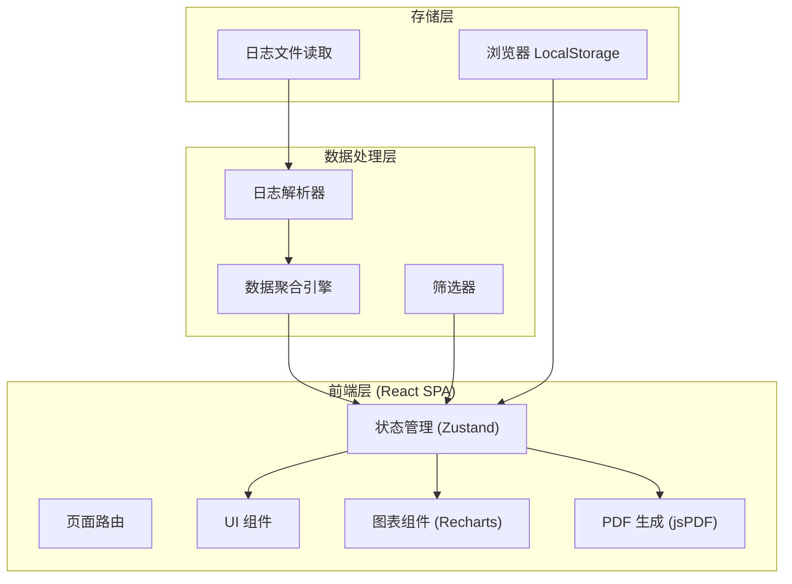

## 1. 架构设计



## 2. 技术选型

- **前端框架**：React 18 + TypeScript
- **构建工具**：Vite 5
- **样式方案**：TailwindCSS 3 + CSS Variables
- **状态管理**：Zustand
- **图表可视化**：Recharts
- **PDF 生成**：jsPDF + html2canvas
- **图标库**：Lucide React
- **路由**：React Router v6
- **桌面封装**：Electron (后续封装)
- **数据格式**：JSON 日志文件模拟

## 3. 路由定义

| 路由 | 页面 | 描述 |
|------|------|------|
| `/` | 数据导入页 | 选择浏览器类型，导入日志 |
| `/dashboard` | 投递总览仪表盘 | 关键指标 + 成功投递列表 |
| `/job/:id` | 岗位详情页 | JD 信息 + 加分项 |
| `/deductions` | 扣分项统计页 | 分类统计图表 + 详情列表 |
| `/export` | 导出页 | 日期筛选 + PDF 下载 |

## 4. 数据模型

### 4.1 日志数据结构

```typescript
// 单条投递日志
interface DeliveryLog {
  id: string;
  timestamp: string; // ISO 8601
  browser: 'chrome' | 'firefox';
  companyName: string;
  jobTitle: string;
  status: 'success' | 'failed' | 'pending';
  jd: string; // 职位描述
  bonusPoints: BonusPoint[]; // 加分项
  deductions: Deduction[]; // 扣分项
  url: string;
}

// 加分项
interface BonusPoint {
  category: string;
  description: string;
  matched: boolean;
}

// 扣分项
interface Deduction {
  type: string; // 扣分种类
  reason: string; // 扣分原因
  timestamp: string;
}

// 扣分项统计
interface DeductionStat {
  type: string;
  count: number;
  percentage: number;
}

// 应用全局状态
interface AppState {
  logs: DeliveryLog[];
  selectedBrowser: 'chrome' | 'firefox' | null;
  isLoading: boolean;
  filterDateRange: [Date, Date] | null;
  
  // 计算属性
  successLogs: DeliveryLog[];
  failedLogs: DeliveryLog[];
  totalCount: number;
  successRate: number;
  deductionStats: DeductionStat[];
}
```

### 4.2 模拟数据说明

应用内置模拟日志数据生成器，模拟 Boss 直聘自动投递的典型日志格式：

- 随机生成 50-100 条投递记录
- 包含真实公司名称和岗位名称
- 模拟加分项（技能匹配、经验匹配、学历匹配等）
- 模拟扣分项（年龄不符、学历不够、技能缺失、经验不足、薪资要求过高等）
- 时间分布在最近 30 天内

## 5. 组件树

```
App
├── Layout
│   ├── Sidebar (导航栏)
│   │   ├── NavItem (数据导入)
│   │   ├── NavItem (投递总览)
│   │   ├── NavItem (扣分项统计)
│   │   └── NavItem (导出报告)
│   └── MainContent
│       ├── ImportPage
│       │   ├── BrowserSelector
│       │   └── LogPreview
│       ├── DashboardPage
│       │   ├── StatsCards
│       │   └── SuccessTable
│       ├── JobDetailPage
│       │   ├── JDDisplay
│       │   └── BonusPointsList
│       ├── DeductionsPage
│       │   ├── DeductionChart
│       │   └── DeductionList
│       └── ExportPage
│           ├── DateRangeFilter
│           └── PDFDownloadButton
```

## 6. 开发环境

```bash
# 初始化项目
npm create vite@latest boss-delivery-analyzer -- --template react-ts

# 安装依赖
npm install react-router-dom zustand recharts lucide-react jspdf html2canvas

# 安装 TailwindCSS
npm install -D tailwindcss @tailwindcss/vite

# 启动开发服务器
npm run dev
```